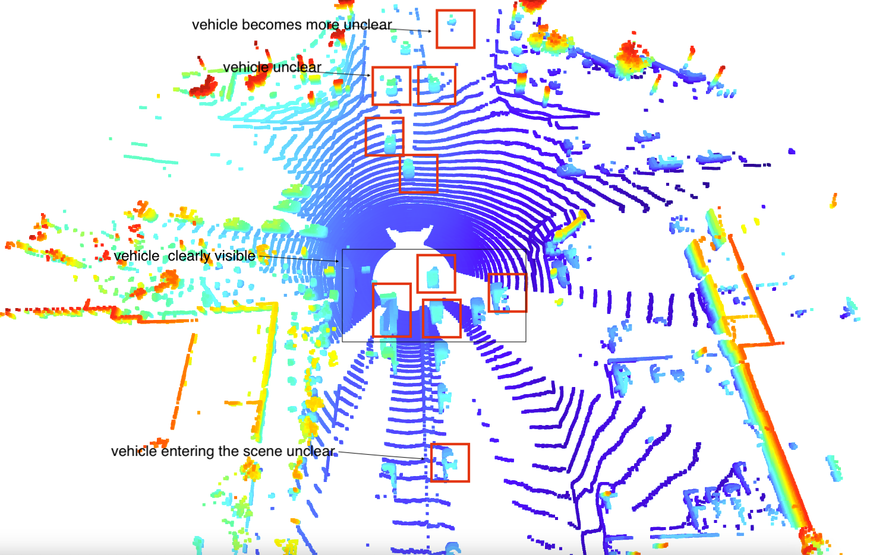
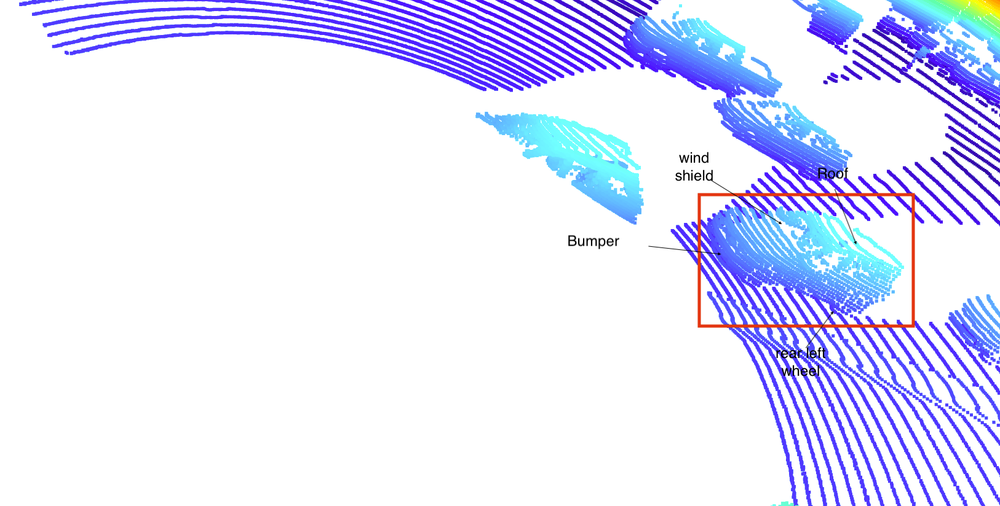

# Find 10 examples of vehicles with varying degrees of visibility in the point-cloud

Vehicle features that are identifiable mostly are - 

* top of the vehicle
* back of the vehicle. 
* On zoom we might see tail light of the vehicle.

The following image shows the presence of vehicle in point cloud map
The vehicles are marked as red box. We can see vehicles entering the scene and moving away from scene becomes unclear. Vehicles in the center are much clearer.

The following image shows some visible feature of a car

# Writeup: Track 3D-Objects Over Time

Please use this starter template to answer the following questions:

### 1. Write a short recap of the four tracking steps and what you implemented there (filter, track management, association, camera fusion). Which results did you achieve? Which part of the project was most difficult for you to complete, and why?

### 2. Do you see any benefits in camera-lidar fusion compared to lidar-only tracking (in theory and in your concrete results)? 

### 3. Which challenges will a sensor fusion system face in real-life scenarios? Did you see any of these challenges in the project?

### 4. Can you think of ways to improve your tracking results in the future?

